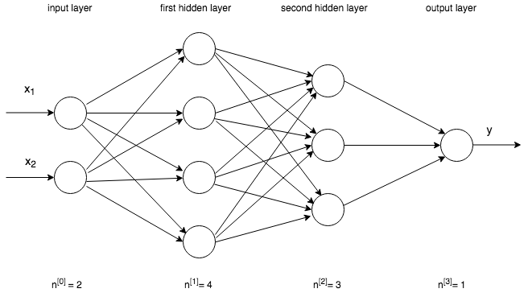

# Perceptrons and Multi Layer Perceptrons


```python
import numpy as np
```

<center><b>The Sigmoid Function</b></center>
$$ \sigma(z) = \frac{1}{1+e^{-z}}$$

<center><b>A Diagram of Simple Perceptron</b></center>


### 1) What are the inputs and outputs of a perceptron?


```python
# Your written answer here
```

### 2) We've completed the sigmoid function for you. Implement the function `perceptron_output` that takes in an array of inputs (`x`) along with predefined weights (`w`), a bias (`b`) and returns the output of a perceptron. 


```python
def sigmoid(input_):
    """
    Transforms an input using the sigmoid function given above
    
    Parameters
    ----------
    input_: input to be transformed
    
    Returns
    --------
    output : float
        result of the application of the sigmoid function 
    """
    
    return 1/(1+np.exp(-1*input_))
```


```python
def perceptron_output(x,w,b):
    """
    Calculates the perceptron output. Should use sigmoid as a helper function.
    
    Parameters
    ----------
    x : np.array
        perceptron inputs
    w : np.array
        perceptron input weights
    b : float
        bias term
    
    Returns
    --------
    y : float
        final output of the perceptron
    """
    
    pass
```

This code tests the `perceptron_output` function, and should produce a value of approximately 0.83


```python
x = [1, .19, 1]
w = [.2, .9, .75]
b = 0.5
```


```python
perceptron_output(x,w,b)
```

<center><b>Diagram of a Multi Layer Perceptron</b></center>



### 3) Describe the process of forward propagation in neural networks


```python
# Your answer here
```

### 4) How does what happens in forward-propagation change what happens in back-propagation? Be as specific as possible.


```python
# Your answer here
```

### 5) Imagine you are trying classifying audio files into five different classes of sounds. What should your activation function be in the output layer and why? 


```python
# Your answer here
```


```python

```
